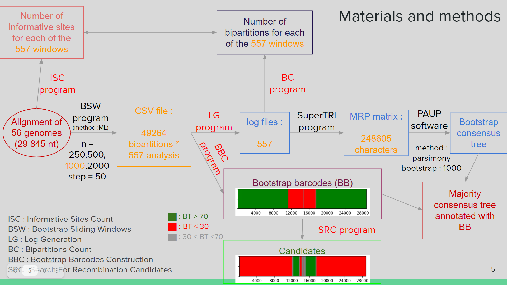

# GB_barcodes_project

Copyright (C) 2022 Alexandre Hassanin MNHN

__Authors :__

Alexandre Hassanin , Dylan Klein, Opale Rambaud

__Contact :__

If you have any questions about this project please send an email at : alexandre.hassanin@mnhn.fr

--------------------------------------------------------------------------------------------------------------------------------------------

This repository is reffered to the following article : Genomic bootstrap barcodes and their application to study the evolution of sarbecoviruses. Please read it to know the context, purpose and methods of the project. 

Ici ce qui suit [Lien](https://www.mdpi.com/1999-4915/14/2/440 "titre de lien optionnel").

Here, we developped a sliding window bootstrap (SWB) method to generate genomic bootstrap (GB) barcodes in order to highlight the regions supporting phylogenetic relationships.

In order to create the csv files with please go in the BSW_programs folder and follow the read_me of the folder. 

In order to analyse the csv files please use this 4 scripts : 

- LG : Log Generation. This script allows to generate the log files from the csv results of BSW. This files can after be used with the SuperTRI program. The input is a vs file with bipartitions in rows and boostrap signal in columns. The output is log files for every windows with all of bipartition with a signal > 1. 

- ISC + BC : Informative Sites Count and Bipartitions Count. This script allows to generate graph of the count of informatives sites per windows and the count of bipartitions per windows. The input is csv files from BSW and a fasta alignement file. The ouput are the two graphes. 

- BBC : Bootstrap Barcodes Construction. This script allows to build the barcode representation from csv file. The input is a csv files with the bipartition you want to visualize in barcode. The input is a barcode per biparttion. 

- SRC : Search For Recombination Candidates. This script allows to make a recombination candidates search. The inputs are the csv file with the bipartion you want to serch for candidates and the csv files with all bipartion who can be candidates. The output is a text file with the candidates per fragment of signal loss. /!\ This script is in an experimental state (not explained in the article).

Here is the general pipeline of the project for a better understanding of the role of each script : 

These scripts are in Jupyter Notebook format. 

